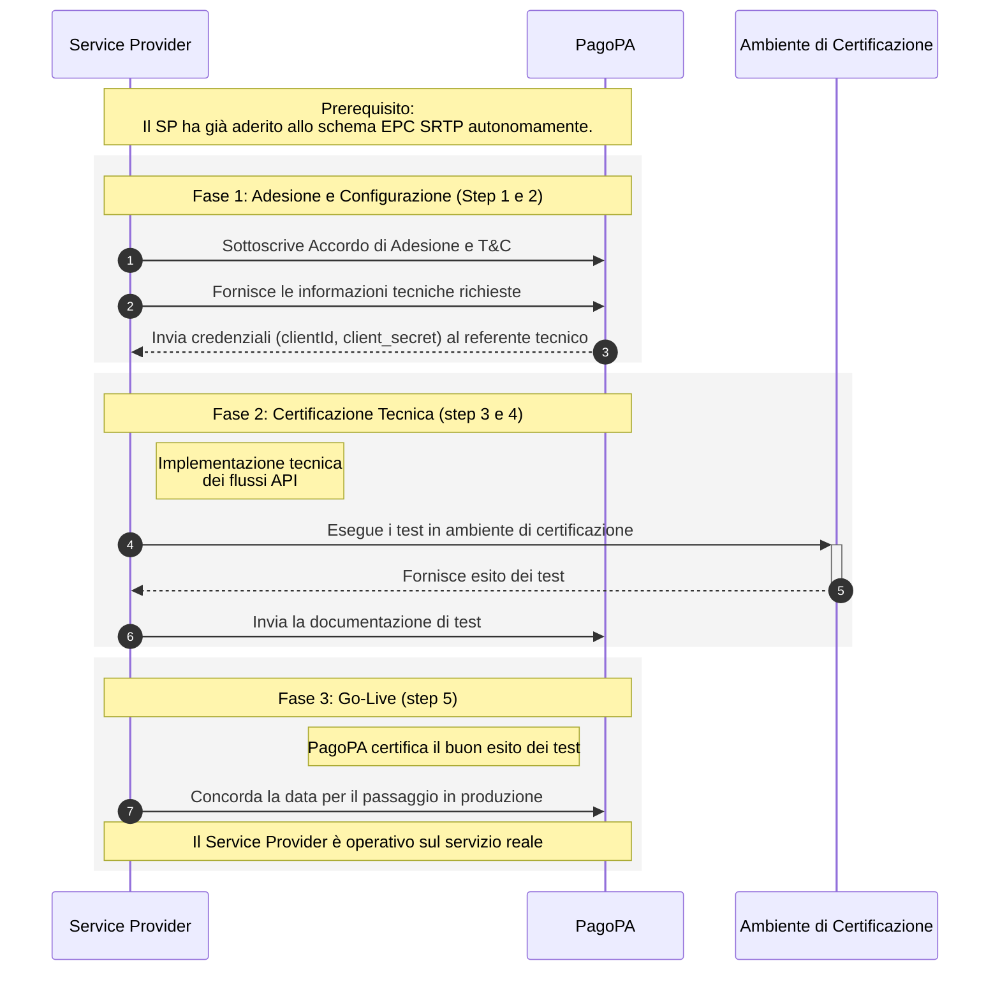
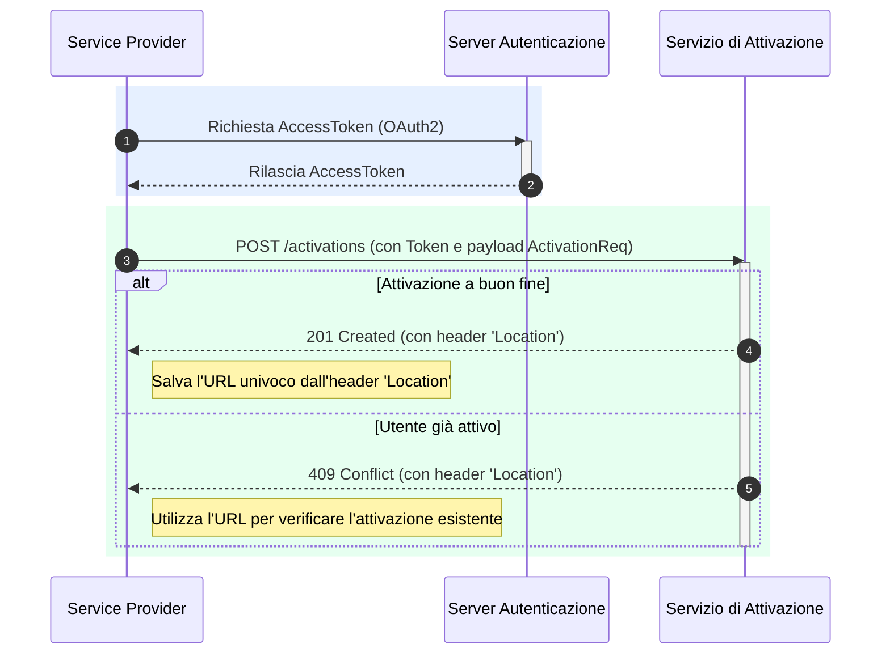
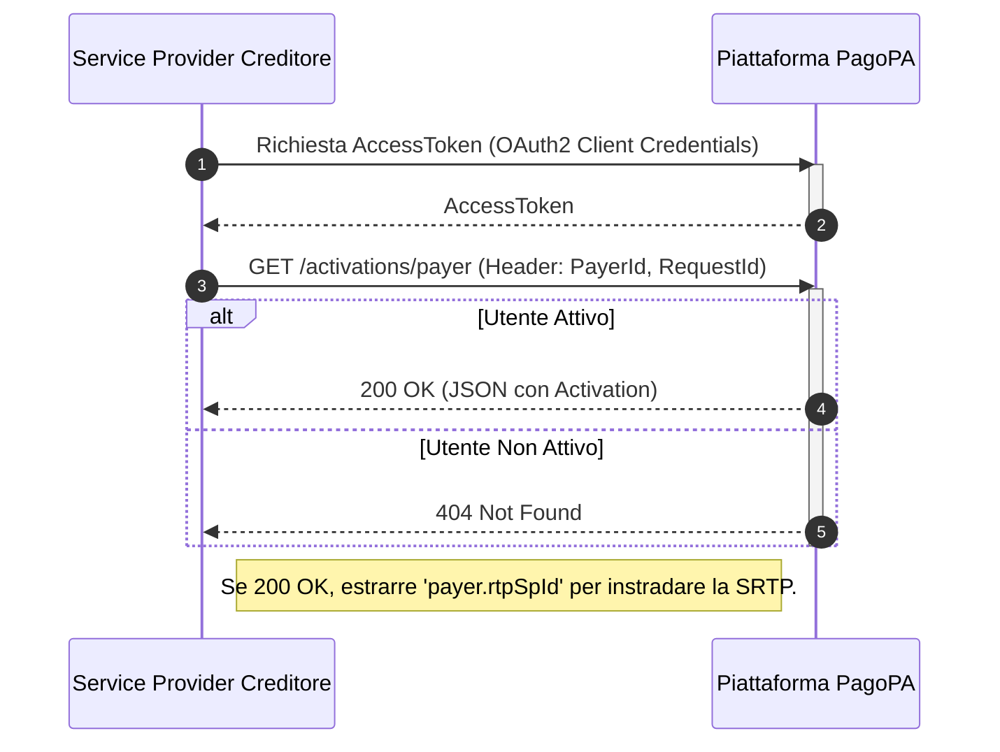
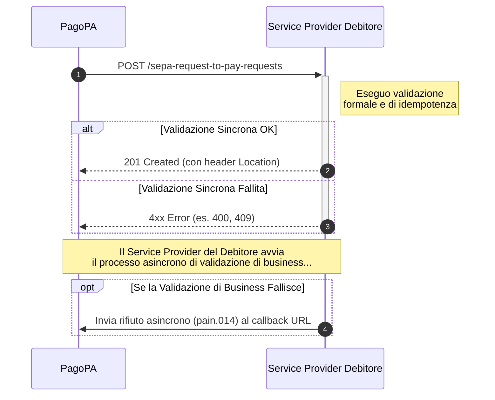
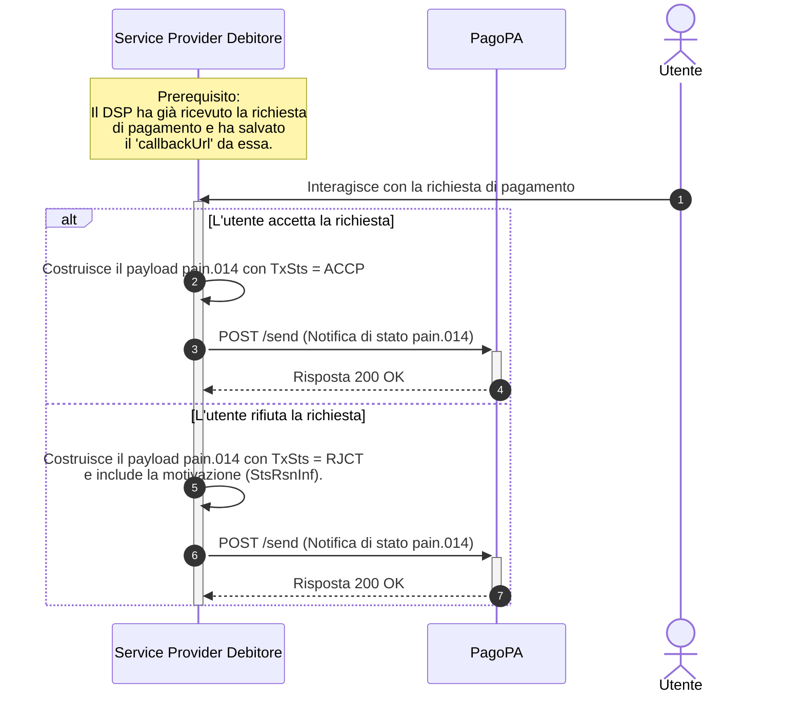
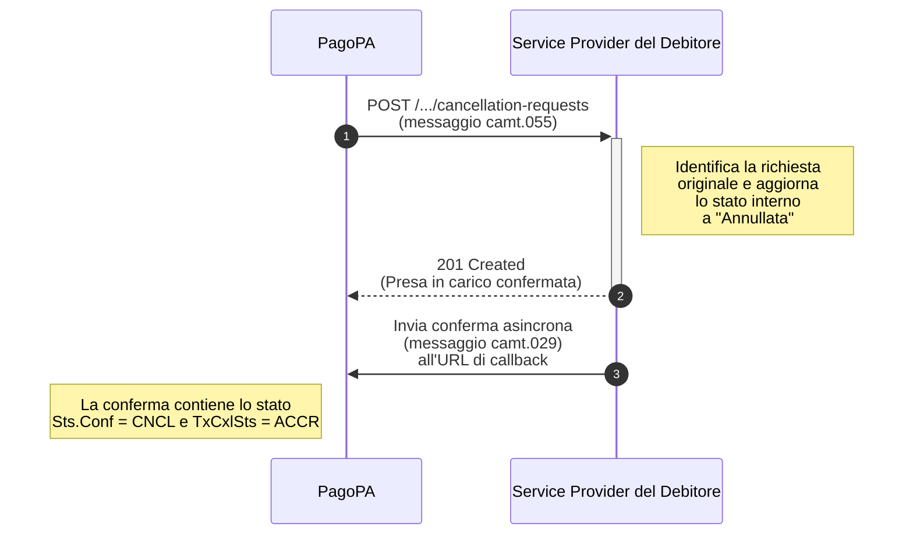

**file:** `RTP/il-prodotto/introduzione.md`

# Introduzione al servizio SRTP

Il servizio Request to Pay (RTP) è un canale digitale che permette a cittadini e imprese di ricevere richieste di pagamento, come gli avvisi pagoPA, direttamente sui propri canali telematici abituali (ad esempio, l'home banking). La soluzione si basa sullo standard europeo **SEPA Request-To-Pay (SRTP)**, un'iniziativa dell'European Payments Council (EPC) per la tramitazione sicura e tracciabile delle richieste di pagamento.

L'obiettivo è superare le modalità tradizionali, rispondendo alla necessità di disporre di un'esperienza di pagamento più evoluta e semplice. Invece di dover recuperare e inserire manualmente i dati di un avviso, con RTP l'utente riceve una notifica precompilata da cui può verificare i dettagli e procedere al saldo in pochi passaggi.


È importante sottolineare che la richiesta è un **invito al pagamento, non un addebito automatico**: l'utente mantiene sempre il pieno controllo su se, come e quando pagare.


L'adozione di questo servizio porta vantaggi concreti a tutti gli attori coinvolti:

  * **Per l'utente finale**:
      * **Semplicità**: Riceve una notifica precompilata e paga direttamente dal canale del proprio PSP preferito, senza dover cercare o trascrivere codici.
      * **Controllo e Trasparenza**: Visualizza tutte le informazioni rilevanti (ente, oggetto, importo, scadenza) prima di decidere di pagare e mantiene il pieno controllo sul processo.
  * **Per l'ecosistema dei pagamenti pubblici**:
      * **Efficienza**: Migliora la chiarezza, la puntualità e la tracciabilità dei pagamenti, garantendo maggiore efficienza per gli Enti Creditori.
      * **Standardizzazione e Automazione**: Semplifica e digitalizza le operazioni di pagamento e le successive attività di riconciliazione.

Nel contesto italiano, [Banca d'Italia ha individuato in PagoPA](https://www.bancaditalia.it/compiti/sispaga-mercati/comitato-pagamenti-italia/CPI-Tavolo-incassi-e-pagamenti-pubblici-RTP-PagoPA.pdf) l'abilitatore di questo strumento per i pagamenti verso la Pubblica Amministrazione. PagoPA fa leva sulla massa critica già raggiunta dalla propria piattaforma per minimizzare gli impatti tecnici di integrazione per le parti coinvolte e offrire una soluzione integrata e interoperabile.

-----

**file:** `RTP/il-prodotto/lo-schema-sepa-request-to-pay-epc.md`

# Lo Schema SEPA Request-to-Pay (EPC)

Il servizio si basa sullo schema **SEPA Request-To-Pay (SRTP)**, un'[iniziativa dell'European Payments Council (EPC)](https://www.europeanpaymentscouncil.eu/what-we-do/other-schemes/sepa-request-pay) che definisce un insieme di regole e messaggi standard per la tramitazione di richieste di pagamento in tutta l'area SEPA.


È importante sottolineare che SRTP non è uno str**umento di pagamento**, ma un protocollo di messaggistica che standardizza il modo in cui una richiesta di pagamento viene inviata, ricevuta e gestita, facilitando la successiva fase di pagamento.


## **Il Modello Four-Corner**

Lo schema si fonda su un **"four-corner model"** (modello a quattro angoli), che prevede l'interazione tra quattro attori principali:

  * **Creditore (Payee)**: Il soggetto che deve ricevere il pagamento e che avvia la richiesta.
  * **Debitore (Payer)**: Il soggetto che deve effettuare il pagamento e che riceve la richiesta.
  * **Service Provider del Creditore**: Il partner tecnologico che aderisce allo schema e invia le richieste SRTP per conto del Creditore.
  * **Service Provider del Debitore**: Il partner tecnologico che aderisce allo schema, riceve le richieste SRTP e le presenta al Debitore sui propri canali.

\<figure\>\\<figcaption\>\</figcaption\>\</figure\>

## **Principi di Funzionamento**

Il flusso di base prevede che il Creditore, tramite il proprio Service Provider, invii una richiesta di pagamento al Service Provider del Debitore, che a sua volta la rende disponibile al Debitore. Una volta ricevuta la notifica, il Debitore può **accettare o rifiutare** la richiesta.

Lo schema EPC definisce diverse modalità con cui un Debitore può gestire una richiesta, basate sulla combinazione di quando accetta e quando intende pagare:

|                  | **PAY NOW** (Paga subito)                                                        | **PAY LATER** (Paga dopo)                                                     |
| ---------------- | -------------------------------------------------------------------------------- | ----------------------------------------------------------------------------- |
| **ACCEPT NOW** | Accetta e procede subito al pagamento.                                           | Accetta subito ma programma il pagamento a una data successiva.               |
| **ACCEPT LATER** | Programma l'accettazione a una data successiva e, contestualmente, il pagamento. | Programma sia la data di accettazione che quella di esecuzione del pagamento. |

## **Ambiti e Flessibilità**

Lo schema EPC è volutamente flessibile su alcuni aspetti per adattarsi a diversi contesti di mercato. Ad esempio, non impone le modalità tecniche di connessione tra i due Service Provider.

Lo standard copre i seguenti processi:

  * Enrollment dei soggetti
  * Attivazione del servizio
  * Invio della richiesta
  * Accettazione o rifiuto
  * Cancellazione della richiesta

Tuttavia, lo schema **non norma la fase di pagamento successiva**. Per questo motivo, un Service Provider non è obbligatoriamente un Prestatore di Servizi di Pagamento (PSP), ma può essere un qualsiasi fornitore tecnologico che aderisce alle regole dello schema. Lo standard è inoltre progettato per essere applicabile a un'ampia gamma di modelli di business (B2C, B2B, G2C, ecc.) e per funzionare a livello transfrontaliero nell'area SEPA.

-----

**file:** `RTP/il-prodotto/flusso-operativo-completo.md`

# Il Flusso Operativo Completo

Per comprendere come interagiscono le diverse componenti del servizio, è utile seguire il percorso completo di una richiesta di pagamento, dalla sua origine fino alla sua conclusione. Il flusso coinvolge l'Ente Creditore, la piattaforma PagoPA (che agisce come Service Provider del Creditore e gestore del repository), il Service Provider del Debitore e l'utente finale.

## Prerequisito: Attivazione dell'Utente

L'intero processo può avvenire solo se l'utente finale (Debitore) ha preventivamente dato il proprio consenso a ricevere le notifiche SRTP tramite il proprio Service Provider, come descritto nel processo di **Attivazione**.

## Invio del Messaggio SRTP

La piattaforma PagoPA, agendo come Service Provider per l'Ente Creditore, identifica la nuova posizione debitoria. Il sistema verifica se il Debitore associato a quell'avviso ha un'attivazione RTP valida. In caso affermativo, PagoPA:

1.  Costruisce il messaggio di richiesta di pagamento (`pain.013`) conforme allo standard SRTP.
2.  Inoltra la richiesta al Service Provider del Debitore corretto, utilizzando le informazioni di raggiungibilità presenti nel proprio registro.

## Ricezione e Presentazione all'Utente (Azione del SP Debitore)

Il Service Provider del Debitore riceve la richiesta di pagamento tramite l'endpoint `POST /sepa-request-to-pay-requests`. A questo punto, il suo compito è:

1.  Validare la richiesta in ingresso.
2.  Processare i dati contenuti nel messaggio.
3.  **Presentare la richiesta di pagamento all'utente finale** all'interno del proprio canale digitale (es. home banking), mostrando chiaramente tutti i dettagli come l'importo, la scadenza e l'oggetto del pagamento.

## Risposta dell'Utente e Notifica di Stato (Azione del SP Debitore)

L'utente visualizza la notifica e decide se accettarla o rifiutarla. Il Service Provider del Debitore ha il compito di comunicare questa scelta. Per farlo, invia una notifica di stato asincrona, tramite una chiamata all'endpoint di **callback** del mittente, contenente un messaggio `pain.014` con l'esito della richiesta.

## Pagamento dell'Avviso

Se l'utente accetta la richiesta, può procedere al pagamento. È importante notare che il pagamento dell'avviso avviene attraverso i normali circuiti di pagoPA e non è tecnicamente parte dello schema SRTP. La notifica RTP agisce come un "promemoria intelligente" che facilita questa operazione.

## Riconciliazione tramite Cancellazione

Quando il pagamento dell'avviso avviene tramite un canale diverso da quello che ha ricevuto la notifica SRTP, (ad esempio, se l'utente riceve la notifica sull'app della sua banca, ma poi paga lo stesso avviso presso un altro prestatore), una volta registrato il pagamento, PagoPA invia una richiesta di cancellazione (`POST /sepa-request-to-pay-requests/{id}/cancellation-requests`) al Service Provider originale per invalidare la notifica. Quest'ultimo, ricevuta la cancellazione, aggiorna lo stato della richiesta nella propria applicazione, chiudendo il ciclo.

-----

**file:** `RTP/il-prodotto/riferimenti-e-documenti-ufficiali.md`

# Riferimenti e Documenti Ufficiali

Per un'analisi completa e approfondita dello standard e delle linee guida su cui si basa il servizio, di seguito sono riportati i link alla documentazione ufficiale di riferimento.

## Documenti dell'European Payments Council (EPC)

L'EPC è l'organismo che definisce e mantiene lo schema SEPA Request-to-Pay.

  * [**SEPA Request-to-Pay (SRTP) Scheme**](https://www.europeanpaymentscouncil.eu/what-we-do/other-schemes/sepa-request-pay)

    La pagina ufficiale dello schema SRTP, dove è possibile consultare e scaricare le ultime versioni del **Rulebook** e dei documenti correlati.

  * [**Clarification Paper on the SRTP Scheme Rulebook**](https://www.europeanpaymentscouncil.eu/document-library/clarification-paper/clarification-paper-sepa-request-pay-scheme-rulebook)

    Un documento che fornisce chiarimenti e interpretazioni specifiche sul Rulebook per supportare gli aderenti in una corretta e uniforme implementazione dello schema.

  * [**Inter-RTP Service Provider SRTP Implementation Guidelines**](https://www.europeanpaymentscouncil.eu/document-library/implementation-guidelines/sepa-request-pay-implementation-guidelines-version-40)

    Le linee guida di implementazione che descrivono le modalità di interazione tecnica tra i diversi Service Provider che aderiscono allo schema.

  * [**Default SRTP related API Specifications**](https://www.europeanpaymentscouncil.eu/document-library/guidance-documents/default-srtp-related-api-specifications)

    Documento di specifiche API versione 3.1 dello standard Single Euro Payments Area (SEPA) Request-to Pay (SRTP)

## Documenti di Contesto Italiano

  * [**Linee Guida del Comitato Pagamenti Italia (CPI) di Banca d'Italia**](https://www.bancaditalia.it/compiti/sispaga-mercati/comitato-pagamenti-italia/CPI-Tavolo-incassi-e-pagamenti-pubblici-RTP-PagoPA.pdf)

    Il documento che illustra le modalità operative concordate dal tavolo "Incassi e pagamenti pubblici" per l'implementazione dello schema SRTP nel contesto specifico di PagoPA e dei pagamenti verso la Pubblica Amministrazione italiana.

-----

**file:** `RTP/guida-tecnica/glossario.md`

# Glossario

**Activation (Attivazione)**
Il processo con cui si stabilisce un accordo tra il Debitore e il Creditore (e i rispettivi Service Provider) per consentire l'invio e la ricezione delle notifiche SRTP.

**Archivio Centralizzato Avvisi (ACA)**
Il sistema gestito da PagoPA dove gli Enti Creditori (o i loro partner) sono tenuti a censire le posizioni debitorie prima di poter avviare un flusso RTP. È noto anche come Gestione Posizioni Debitorie (GPD).

**Callback (Webhook)**
Il meccanismo di comunicazione **asincrona** con cui la piattaforma RTP notifica a un Service Provider un evento, come l'accettazione di una richiesta da parte dell'utente finale. Richiede che il Service Provider esponga un endpoint per ricevere queste chiamate.

**Creditore (Creditor/Payee)**
Il soggetto che deve ricevere il pagamento e che avvia la richiesta di pagamento. Nel contesto di pagoPA, è tipicamente un Ente Creditore.

**Debitore (Debtor/Payer)**
Il soggetto (cittadino o impresa) che deve effettuare il pagamento e che riceve la richiesta di pagamento.

**Discovery Service**
Il servizio, esposto tramite le API di Attivazione, che permette a un Service Provider del Creditore di interrogare il registro centrale per **individuare le informazioni di raggiungibilità** (l'identificativo del PSP) di un utente finale, prima di inviargli una richiesta di pagamento.

**Ente Creditore**
L'ente pubblico, il gestore di pubblici servizi o altro soggetto che emette un avviso di pagamento pagoPA e agisce come Creditore nel flusso SRTP.

**Enrollment**
Processo, eseguito da un Service Provider che ha già completato l'onboarding, con cui un Creditore o un Debitore viene registrato e reso operativo per utilizzare il servizio SRTP. Alla fine di questo processo, il Creditore/Debitore possiede un indirizzo SRTP.

**EPC (European Payments Council)**
L'organismo europeo che ha definito e che gestisce lo standard SEPA Request-To-Pay (SRTP).

**Onboarding**
Il processo con cui un Service Provider aderisce allo schema RTP di PagoPA. Include la sottoscrizione degli accordi legali e la configurazione tecnica necessaria per operare sulla piattaforma, come l'acquisizione delle credenziali.

**PSP (Prestatore di Servizi di Pagamento)**
Un soggetto autorizzato a prestare servizi di pagamento. Nel contesto di RTP, il PSP agisce tipicamente come Service Provider del Debitore.

**RTP (Request to Pay)**
Letteralmente "Richiesta di Pagamento". È il nome comune del servizio di invio di notifiche di pagamento basato sullo schema SRTP.

**Service Provider (SP)**
Un partner tecnologico che aderisce allo schema SRTP per fornire servizi di invio o ricezione delle richieste di pagamento.

  * **Service Provider del Creditore**: Il soggetto tecnologico che invia le richieste SRTP per conto del Creditore.
  * **Service Provider del Debitore**: Il soggetto tecnologico (es. una banca) che riceve le richieste SRTP e le presenta al Debitore sui propri canali digitali.

**SRTP (SEPA Request-To-Pay)**
È il nome ufficiale dello schema definito dall'EPC per la tramitazione delle richieste di pagamento in area SEPA.

-----

**file:** `RTP/guida-tecnica/api-del-servizio-di-attivazione.md`

# API del servizio di attivazione

Queste API sono dedicate alla gestione del ciclo di vita delle attivazioni. Un'attivazione rappresenta il consenso di un utente (Debitore o Payer) a ricevere le richieste di pagamento (SRTP) tramite un determinato Service Provider del Debitore. Le operazioni descritte di seguito permettono di creare, leggere, aggiornare, cancellare e gestire il subentro (takeover) di queste attivazioni.

## **Autenticazione**

Tutte le chiamate a queste API devono essere autenticate tramite protocollo **OAuth2 (Client Credentials Flow)**. È necessario includere un `AccessToken` valido nell'header `Authorization` di ogni richiesta.

## Endpoints

### **Creare una nuova attivazione**

```http
POST /activations
```

Questa operazione viene utilizzata dal Service Provider del Debitore per registrare il consenso di un nuovo utente al servizio RTP. Se esiste già un'attivazione per lo stesso utente (identificato dal Codice Fiscale), il servizio risponderà con un errore `409 Conflict`.

#### **Parametri Header**

  * `RequestId` (UUID, obbligatorio): Identificativo univoco della richiesta.

**Corpo della Richiesta**
Il corpo della richiesta deve contenere un oggetto `ActivationReq`.

*Esempio di payload:*

```json
{
  "payer": {
    "fiscalCode": "RSSMRA85T10A562S",
    "rtpSpId": "12345678911"
  }
}
```

#### **Risposte**

  * **`201 Created`**: L'attivazione è stata registrata con successo. L'header `Location` della risposta conterrà l'URL della risorsa appena creata.
  * **`409 Conflict`**: Esiste già un'attivazione per l'utente indicato.

### **Ottenere un elenco di attivazioni**

```http
GET /activations
```

Restituisce un elenco paginato di tutte le attivazioni associate al Service Provider del Debitore che effettua la richiesta.

**Parametri Query**

  * `page` (integer, obbligatorio): Numero della pagina richiesta.
  * `size` (integer, obbligatorio): Dimensione della pagina (massimo 128).

**Risposte**

  * **`200 OK`**: La richiesta è andata a buon fine. Il corpo della risposta conterrà un oggetto `PageOfActivations` con la lista delle attivazioni e i metadati di paginazione.

### **Ottenere i dettagli di una singola attivazione**

```http
GET /activations/{activationId}
```

Recupera una specifica attivazione tramite il suo ID.

**Parametri Path**

  * `activationId` (UUID, obbligatorio): L'ID univoco dell'attivazione.

**Risposte**

  * **`200 OK`**: La richiesta è andata a buon fine. Il corpo della risposta conterrà un oggetto `Activation` con i dettagli della risorsa.
  * **`404 Not Found`**: L'attivazione con l'ID specificato non esiste o non è associata al Service Provider chiamante.

### **Cancellare un'attivazione**

```http
DELETE /activations/{activationId}
```

Elimina un'attivazione esistente, revocando di fatto il consenso dell'utente a ricevere SRTP tramite il Service Provider associato.

**Parametri Path**

  * `activationId` (UUID, obbligatorio): L'ID univoco dell'attivazione da cancellare.

**Risposte**

  * **`204 No Content`**: L'attivazione è stata cancellata con successo.
  * **`404 Not Found`**: L'attivazione con l'ID specificato non esiste o non è associata al Service Provider chiamante.

### **Trovare un'attivazione tramite Codice Fiscale (Discovery)**

```http
GET /activations/payer
```

Permette di trovare un'attivazione esistente tramite il Codice Fiscale del pagatore. Questa operazione è utilizzata come **Discovery Service** dal Service Provider del Creditore.

**Parametri Header**

  * `PayerId` (string, obbligatorio): Il Codice Fiscale dell'utente da cercare.

**Risposte**

  * **`200 OK`**: È stata trovata un'attivazione per l'utente. Il corpo della risposta conterrà un oggetto `Activation`, il cui campo `payer.rtpSpId` identifica il Service Provider del Debitore a cui inviare le SRTP.
  * **`404 Not Found`**: L'utente non ha attivazioni valide per il servizio RTP.

-----

**file:** `RTP/guida-tecnica/api-per-la-ricezione-delle-richieste-srtp.md`

# API per la ricezione delle richieste SRTP

Questa sezione descrive le API che un **Service Provider del Debitore** deve implementare per agire come **API server** all'interno dell'ecosistema SRTP. Le specifiche sono basate sullo standard ufficiale dell'European Payments Council [EPC133-22](https://www.europeanpaymentscouncil.eu/document-library/guidance-documents/default-srtp-related-api-specifications)

L'interfaccia definisce le operazioni per ricevere nuove richieste di pagamento, permetterne il recupero e gestirne la cancellazione.

## **Autenticazione e Header**

La sicurezza delle comunicazioni è garantita a livello infrastrutturale. Tutte le chiamate ricevute includeranno i seguenti header, che devono essere gestiti come da standard EPC:

  * `X-Request-ID`: Un identificativo per correlare richiesta e risposta.
  * `Idempotency-key`: Una chiave univoca per le operazioni `POST` per gestire in sicurezza eventuali tentativi di invio multiplo della stessa richiesta.

## Endpoints da implementare

### **Ricevere una nuova richiesta di pagamento**

```http
POST /sepa-request-to-pay-requests
```

Questo è l'endpoint principale attraverso cui il tuo servizio riceverà le nuove richieste di pagamento (SRTP) inviate da PagoPA (in qualità di SP del Creditore).

**Corpo della Richiesta**
Il corpo della richiesta conterrà un oggetto `SepaRequestToPayRequestResource`, che incapsula il messaggio `pain.013.001.10` con tutti i dettagli della richiesta. L'endpoint deve salvare l'`Idempotency-key` per prevenire doppie elaborazioni. La struttura dettagliata dei messaggi è descritta nel capitolo [**Riferimento ai Messaggi (Dataset ISO 20022)**.](https://www.google.com/search?q=riferimento-ai-messaggi-dataset-iso-20022.md)

**Risposte**

  * **`201 Created`**: La risposta da inviare se la richiesta è stata accettata e processata correttamente. L'header `Location` deve contenere l'URL della risorsa appena creata.
  * **`400 Bad Request`**: La risposta da inviare se la richiesta è malformata o non valida secondo le regole dello schema SRTP. Il corpo della risposta deve contenere un oggetto `SepaRequestToPayErrorResponseResource_DS04b`.
  * **`401 Unauthorized`**: Le credenziali del chiamante non sono valide o sufficienti per l'operazione.
  * **`406 Not Acceptable`**: Il server non può produrre una risposta conforme agli header `Accept` inviati dal client.
  * **`409 Conflict`**: La risposta da inviare se la richiesta è un duplicato (stessa `Idempotency-key` e stesso payload) di una richiesta già processata. L'header `Location` deve contenere l'URL della risorsa originale.
  * **`415 Unsupported Media Type`**: Il `Content-Type` della richiesta (es. `application/json`) non è supportato dall'endpoint.
  * **`422 Unprocessable Entity`**: La richiesta è formalmente corretta ma non può essere processata per motivi di business (es. `Idempotency-key` riutilizzata con un payload diverso).
  * **`429 Too Many Requests`**: Il client ha superato il numero massimo di richieste consentite in un dato periodo (rate limiting).

### **Ricevere una richiesta di cancellazione**

```http
POST /sepa-request-to-pay-requests/{sepaRequestToPayRequestResourceId}/cancellation-requests
```

Questo endpoint viene invocato da PagoPA per richiedere l'annullamento di una SRTP. Il tuo servizio deve ricevere la richiesta, processarla e aggiornare lo stato della SRTP nei tuoi sistemi.

**Corpo della Richiesta** Il corpo della richiesta conterrà un oggetto `SepaRequestToPayCancellationRequestResource`, che incapsula il messaggio `camt.055.001.08`. La struttura dettagliata è descritta nel capitolo **Riferimento ai Messaggi (Dataset ISO 20022)**.

**Risposte**

  * **`201 Created`**: La risposta da inviare se la richiesta di cancellazione è stata accettata. A seguito di questa operazione, il tuo servizio dovrà inviare la conferma asincrona tramite callback.
  * **`422 Unprocessable Entity`**: La risposta da inviare se non è possibile annullare la SRTP (es. perché già in uno stato finale).

-----

**file:** `RTP/guida-tecnica/api-per-l-invio-delle-risposte-callback.md`

# API per l'invio delle risposte (Callback)

Questa sezione descrive l'API che un **Service Provider del Debitore** deve utilizzare per inviare risposte asincrone al mittente di una richiesta (ovvero, la piattaforma PagoPA). Questo meccanismo è fondamentale per comunicare l'esito di un'operazione a seguito di un'interazione dell'utente finale o di un processo interno.

## **URL della Chiamata**

L'URL a cui inviare la notifica di callback **non è statico**. Deve essere recuperato dinamicamente dal campo `callbackUrl` presente nel corpo della richiesta SRTP (`SepaRequestToPayRequestResource`) originale che hai ricevuto. È tua responsabilità storicizzare questo URL e utilizzarlo per inviare la risposta corrispondente.

## Endpoint

### **Inviare una risposta asincrona**

```http
POST /send
```

Questa operazione viene utilizzata dal Service Provider del Debitore per inoltrare una risposta asincrona al Service Provider del Creditore attraverso l'URL di callback.

**Corpo della Richiesta**
Il corpo della richiesta deve contenere un oggetto `AsynchronousSepaRequestToPayResponseResource`, che incapsula il messaggio ISO 20022 appropriato per la notifica che si sta inviando. Ad esempio:

  * Per una **risposta di stato**, il wrapper conterrà un messaggio `pain.014`.

La struttura dettagliata dei messaggi da inserire è descritta nel capitolo **Riferimento ai Messaggi (Dataset ISO 20022)**.

**Risposte**

  * **`200 OK`**: La notifica di callback è stata ricevuta e accettata correttamente dal server del mittente.
  * **`400 Bad Request`**: La richiesta è malformata.
  * **`403 Forbidden`**: Non sei autorizzato a effettuare l'operazione.

-----

**file:** `RTP/guida-tecnica/riferimento-ai-messaggi-dataset-iso-20022.md`

# Riferimento ai messaggi (Dataset ISO-20022)

A differenza del Servizio di Attivazione, l'interazione tra Service Provider per lo scambio di richieste di pagamento si basa sullo standard [EPC133-22](https://www.europeanpaymentscouncil.eu/document-library/guidance-documents/default-srtp-related-api-specifications) Questo standard prevede che le chiamate API contengano nel corpo della richiesta un oggetto risorsa (es. `SepaRequestToPayRequestResource`) che incapsula un messaggio conforme allo standard **ISO 20022**.

Questa sezione fornisce una guida dettagliata alla struttura di questi messaggi, distinguendo tra quelli che, in qualità di Service Provider del Debitore, dovrai **interpretare** (in entrata) e quelli che dovrai **costruire** (in uscita). Per la struttura completa e definitiva di ogni campo, si rimanda alla specifica OpenAPI ufficiale dell'EPC.

## Messaggi Ricevuti (da Interpretare)

### 1\. Messaggio di Richiesta di Pagamento (`pain.013.001.10`)

Questo è il messaggio che ricevi quando ti viene inoltrata una nuova richiesta di pagamento. È contenuto all'interno dell'oggetto `SepaRequestToPayRequestResource` inviato all'endpoint `POST /sepa-request-to-pay-requests`.

#### **Campi Chiave da Interpretare:**

| Percorso Campo (semplificato)                                | Descrizione                                                                           |
| ------------------------------------------------------------ | ------------------------------------------------------------------------------------- |
| `Document.CdtrPmtActvtnReq.PmtInf.CdtTrfTx.PmtId.EndToEndId` | L'**Identificativo Univoco di Versamento (IUV)**, ovvero il Numero Avviso a 18 cifre. |
| `Document.CdtrPmtActvtnReq.PmtInf.CdtTrfTx.Amt.InstdAmt`     | L'**importo** del pagamento.                                                          |
| `Document.CdtrPmtActvtnReq.PmtInf.XpryDt`                    | La **data di scadenza** della richiesta.                                              |
| `Document.CdtrPmtActvtnReq.PmtInf.CdtTrfTx.RmtInf.Ustrd`     | La **causale** o l'oggetto del pagamento da mostrare all'utente.                      |
| `Document.CdtrPmtActvtnReq.PmtInf.Cdtr.Nm`                   | Il **nome dell'Ente Creditore** (beneficiario).                                       |
| `Document.CdtrPmtActvtnReq.GrpHdr.MsgId`                     | L'ID univoco del messaggio, da conservare per le successive correlazioni.             |
| `callbackUrl`                                                | L'**URL di callback** a cui dovrai inviare la risposta di stato asincrona.            |

### 2\. Messaggio di Richiesta di Cancellazione (`camt.055.001.08`)

Questo è il messaggio che ricevi quando una SRTP deve essere annullata. È contenuto nell'oggetto `SepaRequestToPayCancellationRequestResource` inviato all'endpoint `POST /sepa-request-to-pay-requests/{id}/cancellation-requests`.

#### **Campi Chiave da Interpretare:**

| Percorso Campo (semplificato)                                              | Descrizione                                                                  |
| -------------------------------------------------------------------------- | ---------------------------------------------------------------------------- |
| `Document.CstmrPmtCxlReq.Undrlyg.OrgnlPmtInfAndCxl.TxInf.OrgnlEndToEndId`  | Lo **IUV** della richiesta originale da cancellare, per correlazione.        |
| `Document.CstmrPmtCxlReq.Undrlyg.OrgnlPmtInfAndCxl.TxInf.CxlRsnInf.Rsn.Cd` | Il **codice** che indica il motivo della cancellazione (es. `PAID`, `MODT`). |

-----

## Messaggi Inviati (da Costruire)

### 3\. Messaggio di Risposta di Stato (`pain.014.001.07`)

Questo è il messaggio che devi costruire e inviare all'URL di `callback` per notificare l'esito (accettazione o rifiuto) di una richiesta da parte dell'utente. È contenuto nell'oggetto `AsynchronousSepaRequestToPayResponseResource`.

#### **Campi Chiave da Costruire:**

| Percorso Campo (semplificato)                                                    | Descrizione                                                                                                                                                                                                                                 |
| -------------------------------------------------------------------------------- | ------------------------------------------------------------------------------------------------------------------------------------------------------------------------------------------------------------------------------------------- |
| `Document.CdtrPmtActvtnReqStsRpt.OrgnlGrpInfAndSts.OrgnlMsgId`                   | L'ID del messaggio `pain.013` originale a cui stai rispondendo.                                                                                                                                                                             |
| `Document.CdtrPmtActvtnReqStsRpt.OrgnlPmtInfAndSts.TxInfAndSts.OrgnlEndToEndId`  | Lo **IUV** della richiesta originale.                                                                                                                                                                                                       |
| `Document.CdtrPmtActvtnReqStsRpt.OrgnlPmtInfAndSts.TxInfAndSts.TxSts`            | \<p\>Lo \<strong\>stato\</strong\> della richiesta, da valorizzare con: - \<code\>ACCP\</code\> → accettato dall'utente\<br\>\<code\>ACTC\</code\> → accettato dal service provider\<br\>\<code\>RJCT\</code\> → rifiutato dall'utente o dal service provider\</p\> |
| `Document.CdtrPmtActvtnReqStsRpt.OrgnlPmtInfAndSts.TxInfAndSts.StsRsnInf.Rsn.Cd` | In caso di rifiuto, il codice che ne specifica il motivo.                                                                                                                                                                                   |

-----

**file:** `RTP/tutorial/come-aderire-al-servizio.md`

# Come aderire al servizio

Questo tutorial descrive il processo di **Onboarding**, ovvero i passaggi che un Service Provider deve seguire per aderire al servizio RTP, ottenere le credenziali necessarie per l'integrazione tecnica e diventare pienamente operativo.



## **Prerequisito: Adesione allo schema EPC**

Prima di avviare il processo di onboarding con PagoPA, è necessario che il tuo istituto abbia aderito allo schema SEPA Request-to-Pay (SRTP) seguendo le regole definite nel Rulebook dell'European Payments Council (EPC). Questa attività non è gestita da PagoPA.

## **Step 1: Sottoscrivere l'Accordo di Adesione con PagoPA**

Il primo passo consiste nel formalizzare l'adesione al servizio tramite la sottoscrizione della convenzione e dei Termini e Condizioni (T\&C) forniti da PagoPA.

## **Step 2: Fornire le Informazioni Tecniche**

Durante la fase di adesione, dovrai compilare un allegato tecnico con tutte le informazioni necessarie alla configurazione del tuo servizio sulla piattaforma. I dati richiesti includono:

  * **Identificativo del Service Provider**: Il tuo Bank Identifier Code (BIC) o, in sua assenza, il codice fiscale della tua organizzazione.
  * **Eventuale TPSP:** Se ti avvali di un Technical Service Provider (TPSP) per l'integrazione, dovrai fornire anche il suo identificativo.
  * **Ruolo ricoperto**: In questo contesto, "Service Provider del Debitore".
  * **Identificativo del canale pagoPA**: Il canale che verrà utilizzato per i pagamenti degli avvisi notificati tramite SRTP.
  * **Contatti**: L'indirizzo email di un referente tecnico per il supporto all'integrazione e l'elenco degli utenti (beta-tester) che opereranno in ambiente di test.

## **Step 3: Ricevere le Credenziali di Accesso**

A seguito della sottoscrizione del contratto e della fornitura dei dati tecnici, il referente tecnico indicato riceverà via email le credenziali di accesso ai servizi. Nello specifico, verranno comunicati `clientId` e `client_secret`, indispensabili per l'autenticazione OAuth2 e per l'utilizzo delle API.

## **Step 4: Eseguire i Test in Ambiente di Certificazione (UAT)**

Una volta ottenute le credenziali, dovrai procedere con l'integrazione tecnica e la certificazione in ambiente di test (UAT). Questa fase prevede l'implementazione dei flussi API e l'esecuzione di una serie di prove per verificare il corretto funzionamento della tua integrazione, che andranno documentate secondo le modalità fornite.

## **Step 5: Pianificare il Passaggio in Produzione**

Dopo aver completato con successo la fase di test e ottenuto la certificazione, potrai concordare con PagoPA la data per il passaggio in produzione e iniziare a operare nel servizio reale.

-----

**file:** `RTP/tutorial/come-attivare-un-utente-al-servizio.md`

# Come attivare un utente al servizio

Questo tutorial ti guida attraverso il processo tecnico di **Enrollment** e **Attivazione** di un utente (Debitore). Questa operazione, eseguita dal Service Provider del Debitore, è fondamentale per registrare il consenso dell'utente a ricevere notifiche SRTP e renderlo raggiungibile dai Service Provider dei Creditori.

Il flusso si basa sull'invocazione delle API del Servizio di Attivazione, dopo essersi autenticati.



## **Step 1: Ottenere l'AccessToken (Autenticazione)**

Come per tutte le operazioni verso la piattaforma, il primo passo consiste nell'ottenere un token di autenticazione valido.

1.  Effettua una chiamata al server di autenticazione PagoPA utilizzando lo schema **OAuth2 Client Credential Grant Type**.
2.  Includi nella richiesta il tuo `client_id` e `client_secret`, che hai ricevuto durante il processo di adesione.
3.  Il server risponderà con un `AccessToken` che dovrai utilizzare nel passo successivo.

## **Step 2: Preparare il corpo della richiesta (`ActivationReq`)**

Per attivare un utente, dovrai costruire un semplice oggetto JSON che contiene i suoi dati identificativi e quelli del tuo servizio.

**Esempio di Payload di Attivazione**

```json
{
  "payer": {
    "fiscalCode": "RSSMRA85T10A562S",
    "rtpSpId": "12345678911"
  }
}
```

  * `payer.fiscalCode`: Il Codice Fiscale dell'utente che ha dato il consenso.
  * `payer.rtpSpId`: L'identificativo (BIC o P.IVA) del tuo servizio di Service Provider.

## **Step 3: Invocare l'API di Attivazione**

Una volta ottenuto l'`AccessToken` e preparato il payload, puoi procedere con la richiesta di attivazione.

**Endpoint**

```http
POST /activations
```

Includi l'`AccessToken` nell'header `Authorization` come Bearer Token e il JSON `ActivationReq` nel corpo della richiesta.

## **Step 4: Gestire la risposta del servizio**

L'esito della chiamata ti informa se l'attivazione è andata a buon fine o se l'utente era già attivo.

  * **Caso di Successo (`201 Created`)** La risposta indica che l'utente è stato attivato con successo. **Importante**: recupera e salva il valore dell'header `Location` della risposta. Contiene l'URL univoco dell'attivazione, che include l'`activationId` necessario per gestire la risorsa in futuro (es. per cancellarla).
  * **Caso di Utente Già Attivo (`409 Conflict`)** Questo errore indica che esiste già un'attivazione per il Codice Fiscale fornito. L'header `Location` conterrà l'URL dell'attivazione esistente. Puoi utilizzare questo URL per recuperare i dettagli (`GET /activations/{activationId}`) e verificare se l'attivazione è già associata al tuo SP o se è necessario avviare un processo di subentro (takeover).

-----

**file:** `RTP/tutorial/come-individuare-le-informazioni-di-un-service-provider.md`

# Come individuare le informazioni di un Service Provider

Questo tutorial dedicato ai **Service Provider del Creditore diversi da PagoPA** spiega come utilizzare il Discovery Service, esposto tramite le API di Attivazione, per verificare se un utente è attivo al servizio RTP e per ottenere l'identificativo tecnico del suo Service Provider del Debitore. Questa informazione è indispensabile per poter instradare correttamente una richiesta di pagamento.



## **Step 1: Ottenere un AccessToken**

Come per tutte le chiamate API verso la piattaforma, il primo passo consiste nell'ottenere un `AccessToken` valido tramite il flusso OAuth2 Client Credentials, utilizzando le proprie credenziali.

## **Step 2: Interrogare il Discovery Service**

Per scoprire le informazioni di raggiungibilità di un utente, è necessario interrogare l'endpoint di ricerca del Servizio di Attivazione.

### **Endpoint**

```http
GET /activations/payer
```

#### **Parametri Header**

  * `PayerId` (header, obbligatorio): Il Codice Fiscale dell'utente (pagatore) di cui si vogliono conoscere le informazioni di attivazione.
  * `RequestId` (header, obbligatorio): Un UUID per identificare la richiesta.

## **Step 3: Interpretare la Risposta (Come vengono erogate le informazioni)**

L'esito della chiamata determina se è possibile o meno inviare una SRTP all'utente.

  * **Caso di Successo (`200 OK`)** PagoPA eroga le informazioni restituendo un oggetto `Activation` in formato JSON. Il campo chiave da estrarre per l'instradamento della SRTP è:
      * **`payer.rtpSpId`**: Questo valore è l'identificativo tecnico (BIC o P.IVA) del Service Provider del Debitore a cui dovrai inviare la successiva richiesta di pagamento.
  * **Caso di Utente Non Attivo (`404 Not Found`)** Se ricevi questo codice di errore, significa che l'utente identificato dal Codice Fiscale non ha un'attivazione valida per il servizio RTP. **Non è possibile inviargli una richiesta di pagamento**.

-----

**file:** `RTP/tutorial/come-ricevere-e-validare-una-richiesta-di-pagamento.md`

# Come ricevere e validare una richiesta di pagamento

Questo tutorial ti guida attraverso i passaggi necessari per ricevere, validare e processare correttamente una richiesta di pagamento (SRTP) in entrata, inviata da PagoPA secondo le specifiche descritte in [API per la ricezione delle richieste SRTP](https://www.google.com/search?q=../guida-tecnica/api-per-la-ricezione-delle-richieste-srtp.md).

L'implementazione di questo flusso è il cuore del servizio, in quanto abilita la ricezione delle notifiche da presentare ai tuoi utenti finali.



## **Step 1: Implementa l'endpoint di ricezione**

Per prima cosa, il tuo sistema deve esporre un endpoint in grado di ricevere le richieste. Questo endpoint diventerà il punto di ingresso per tutte le SRTP destinate ai tuoi utenti.

### **Endpoint (da implementare)**

```http
POST /sepa-request-to-pay-requests
```

## **Step 2: Gestisci gli Header della Richiesta**

Ogni richiesta in entrata conterrà degli header HTTP standard che devi gestire correttamente.

  * **`Idempotency-key`**: Questo header è fondamentale per prevenire la doppia elaborazione di una stessa richiesta. La tua logica deve:
    1.  Salvare l'`Idempotency-key` della prima richiesta ricevuta.
    2.  Se ricevi una nuova richiesta con una chiave già vista, devi verificare se il payload è identico. Se lo è, restituisci la risposta originale (`201 Created`); se è diverso, restituisci un errore (`422 Unprocessable Entity`).
  * **`X-Request-ID`**: Un ID di correlazione da utilizzare per il logging e il troubleshooting.

## **Step 3: Valida il Corpo della Richiesta (`SepaRequestToPayRequestResource`)**

La validazione del payload avviene in due fasi:

1.  **Validazione Sincrona (immediata)**: Appena ricevi la richiesta, esegui una validazione formale per assicurarti che il corpo contenga un oggetto `SepaRequestToPayRequestResource` valido e che il messaggio `pain.013` incapsulato sia strutturalmente corretto. Se questa validazione fallisce, rispondi immediatamente con un errore (vedi Step 4).
2.  **Validazione di Business (successiva)**: Dopo aver confermato la presa in carico (vedi Step 4), esegui controlli più approfonditi. Ad esempio, verifica che il Codice Fiscale del pagatore (`Payer`) corrisponda a un utente attivo sul tuo servizio.

## **Step 4: Invia la Risposta Sincrona**

Dopo la validazione formale, devi inviare una risposta immediata per comunicare l'esito della presa in carico.

  * **Caso di Successo**: Se la validazione iniziale ha successo, salva la richiesta e rispondi con:
      * **`201 Created`**: Questo status code conferma al chiamante che la richiesta è stata accettata per l'elaborazione.
      * **Header `Location`**: Includi in risposta l'URL univoco della risorsa che hai appena creato.
  * **Caso di Errore**: Se la validazione iniziale fallisce, rispondi con un codice di errore appropriato, ad esempio:
      * **`400 Bad Request`**: Per richieste malformate o non valide.
      * **`409 Conflict`**: Se la richiesta è un duplicato (stessa `Idempotency-key`).

## **Step 5: Gestisci il Rifiuto Asincrono (DS-04)**

Questo passaggio è necessario se la validazione di business (descritta nello Step 3) fallisce **dopo** che hai già risposto `201 Created`.

In questo scenario, devi notificare al mittente che non puoi processare la richiesta. Per farlo, invia un messaggio di rifiuto asincrono (`pain.014` con motivazione tecnica) all'URL di `callback` che hai ricevuto nel corpo della richiesta originale.

-----

**file:** `RTP/tutorial/come-inviare-una-risposta-di-stato-via-callback.md`

# Come inviare una Risposta di Stato via Callback

Dopo che un utente ha interagito con una richiesta di pagamento nella tua applicazione (accettandola o rifiutandola), in qualità di Service Provider del Debitore, hai il compito di comunicare questa decisione al mittente (PagoPA).

Questa operazione viene eseguita in modo asincrono, invocando un endpoint di callback con un messaggio di stato `pain.014`.



## **Step 1: Identifica l'URL di Callback**

L'URL a cui inviare la notifica di stato non è un indirizzo statico. Devi recuperare dinamicamente l'URL corretto dal campo `callbackUrl` presente nel corpo della richiesta di pagamento (`SepaRequestToPayRequestResource`) originale che hai ricevuto.

È fondamentale che il tuo sistema associ questo `callbackUrl` alla richiesta di pagamento per poterlo utilizzare in questo passaggio.

## **Step 2: Costruisci il corpo della richiesta (`pain.014.001.07`)**

Devi costruire un messaggio `pain.014` che contenga l'esito dell'operazione. Questo messaggio sarà incapsulato in un oggetto `AsynchronousSepaRequestToPayResponseResource`.

Campi Chiave da Valorizzare:

  * Correlazione: Compila i campi `OrgnlMsgId` e `OrgnlEndToEndId` con i valori esatti ricevuti nella richiesta `pain.013` originale. Questo permette al mittente di associare la tua risposta alla richiesta corretta.
  * Stato: Il campo `TxSts` è il più importante e deve essere valorizzato con:
      * `ACCP`: Se l'utente ha accettato la richiesta.
      * `RJCT`: Se l'utente ha rifiutato la richiesta.
  * Motivazione: In caso di rifiuto, è buona norma compilare il blocco `StsRsnInf` per specificarne il motivo.

### **Esempio di Payload di Accettazione (`pain.014`)**

```json
{
    "Document": {
        "CdtrPmtActvtnReqStsRpt": {
            "GrpHdr": {
                "MsgId": "MSG-ID-RISPOSTA-UNIVOCO",
                "CreDtTm": "2025-07-28T17:30:00.000Z",
                "InitgPty": {
                    "Nm": "Mario Rossi",
                    "Id": { "OrgId": { "Othr": { "Id": "RSSMRA85T10A562S", "SchmeNm": { "Cd": "POID" } } } }
                }
            },
            "OrgnlGrpInfAndSts": {
                "OrgnlMsgId": "ab85fbb7a48a4a669b5436ee5b497036",
                "OrgnlMsgNmId": "pain.013.001.10",
                "OrgnlPmtInfAndSts": [
                    {
                        "OrgnlPmtInfId": "ab85fbb7a48a4a669b5436ee5b497036",
                        "TxInfAndSts": {
                            "OrgnlEndToEndId": "311111111112222222",
                            "TxSts": "ACCP"
                        }
                    }
                ]
            }
        }
    }
}
```

## **Step 3: Invia la notifica di stato**

Una volta preparato il payload, esegui la chiamata API.

### Endpoint

```
POST /send
```

1.  Effettua una chiamata `POST` all'URL di `callback` recuperato nello Step 1.
2.  Inserisci il payload JSON che hai costruito nel corpo della richiesta.

## **Step 4: Gestisci la risposta alla callback**

Se la tua notifica è stata ricevuta correttamente dal server di PagoPA, riceverai una risposta immediata con uno status code `200 OK`. Questo conferma che la comunicazione è avvenuta con successo.

-----

**file:** `RTP/tutorial/come-ricevere-e-gestire-una-richiesta-di-cancellazione.md`

# Come ricevere e gestire una richiesta di cancellazione

Questo tutorial ti guida, in qualità di Service Provider del Debitore, attraverso i passaggi necessari per gestire correttamente una richiesta di cancellazione (RfC) in entrata. Questa operazione viene avviata da PagoPA quando un avviso di pagamento è stato annullato o pagato tramite altri canali.

Il processo prevede la ricezione di una richiesta, l'aggiornamento dello stato nei tuoi sistemi e l'invio di una notifica di conferma asincrona.



## **Step 1: Implementa l'endpoint di ricezione della cancellazione**

Il tuo sistema deve esporre un endpoint in grado di ricevere le richieste di cancellazione inviate da PagoPA.

### **Endpoint (da implementare)**

```http
POST /sepa-request-to-pay-requests/{sepaRequestToPayRequestResourceId}/cancellation-requests
```

## **Step 2: Ricevi e processa il messaggio di cancellazione (`camt.055`)**

Quando ricevi una chiamata su questo endpoint, il corpo della richiesta conterrà un oggetto `SepaRequestToPayCancellationRequestResource`, che incapsula un messaggio `camt.055.001.08`.

1.  **Identifica la richiesta originale**: Usa l'`sepaRequestToPayRequestResourceId` ricevuto nel path e i dati di correlazione all'interno del messaggio (es. `OrgnlEndToEndId`) per individuare la richiesta di pagamento da annullare nel tuo sistema.
2.  **Aggiorna lo stato**: Modifica lo stato della richiesta nella tua applicazione, mostrandola all'utente come "Annullata" o "Già pagata". Questo è un passaggio cruciale per impedire all'utente di tentare un pagamento non più dovuto.
3.  **Rispondi alla chiamata**: Invia una risposta sincrona con status code **`201 Created`** per confermare la presa in carico della richiesta di cancellazione.

## **Step 3: Invia la conferma di cancellazione asincrona (`camt.029`)**

Dopo aver processato la richiesta, devi inviare una conferma asincrona all'URL di `callback` del mittente (ricevuto nella richiesta di pagamento originale).

### **Campi Chiave da Valorizzare:**

  * **Correlazione**: Includi gli identificativi della richiesta di cancellazione (`camt.055`) a cui stai rispondendo.
  * **Stato**: Imposta il campo `Sts.Conf` su `CNCL` (Cancelled) e `TxCxlSts` su `ACCR` (AcceptedCancellationRequest) per confermare l'esito positivo.

### **Esempio di Payload di Conferma Cancellazione (`camt.029`)**

```json
{
  "resourceId": "string",
  "SepaRequestToPayCancellationResponse": {
    "Document": {
      "RsltnOfInvstgtn": {
        "Assgnmt": {
          "Id": "ID_DELLA_RICHIESTA_DI_CANCELLAZIONE",
          "Assgnr": { /* Dati di chi ha assegnato il task */ },
          "Assgne": { /* Dati di chi ha eseguito il task */ },
          "CreDtTm": "2025-07-28T18:00:00.000Z"
        },
        "Sts": {
          "Conf": "CNCL"
        },
        "CxlDtls": {
          "OrgnlPmtInfAndSts": [
            {
              "TxInfAndSts": [
                {
                  "OrgnlEndToEndId": "IUV_DELLA_RICHIESTA_ORIGINALE",
                  "TxCxlSts": "ACCR"
                }
              ]
            }
          ]
        }
      }
    }
  }
}
```

Invia questo payload all'endpoint di `callback` per completare il processo di cancellazione.

-----

**file:** `RTP/casi-duso/invio-di-un-avviso-tari-a-un-cittadino-e-gestione-del-pagamento.md`

# Invio di un avviso TARI a un cittadino e gestione del pagamento

In questo caso d'uso di esempio, descriviamo il ciclo di vita completo di una richiesta di pagamento. Lo scenario mostra come le diverse API e i messaggi standard interagiscono in un caso d'uso reale, dal momento in cui una richiesta arriva a un Service Provider del Debitore fino alla sua riconciliazione finale.

**Attori dello scenario:**

  * **Laura**: una cittadina.
  * **La sua Banca**: che agisce come Service Provider del Debitore.
  * **Comune di Milano**: l'Ente Creditore.
  * **PagoPA**: che agisce come Service Provider del Creditore.

**Prerequisiti**

Perché questo flusso possa iniziare, assumiamo che due condizioni siano già state soddisfatte:

1.  Laura ha già attivato il servizio RTP tramite l'app della sua Banca.
2.  Il Comune di Milano ha già censito una posizione debitoria (es. la TARI) per Laura nell'Archivio Centralizzato Avvisi.

## **Fase 1: Ricezione della Richiesta di Pagamento (`pain.013`)**

Il processo inizia quando PagoPA, per conto del Comune, invia una SRTP alla Banca di Laura.

1.  **Azione**: Il sistema della Banca riceve una chiamata sull'endpoint `POST /sepa-request-to-pay-requests`. Il corpo della richiesta contiene un oggetto `SepaRequestToPayRequestResource` che incapsula un messaggio `pain.013` con tutti i dettagli della TARI di Laura.
2.  **Validazione**: La Banca valida la richiesta e risponde `201 Created` per confermare la presa in carico.
3.  **Processamento**: Il sistema della Banca processa i dati del `pain.013` e prepara la notifica da mostrare a Laura.


Per i dettagli tecnici su come implementare questo passaggio, consulta il tutorial: [**Come ricevere e validare una Richiesta di Pagamento**](https://www.google.com/search?q=./tutorial/come-ricevere-e-validare-una-richiesta-di-pagamento).


## **Fase 2: Interazione dell'Utente e Invio dello Stato (`pain.014`)**

Laura riceve una notifica push dalla sua app bancaria.

1.  **Azione dell'Utente**: Laura apre l'app, visualizza i dettagli della richiesta di pagamento TARI precompilata (importo, scadenza, ente) e preme il pulsante "Accetta".
2.  **Azione della Banca**: A seguito dell'accettazione, il sistema della Banca ha il compito di notificare l'esito a PagoPA. Per farlo:
      * Costruisce un messaggio `pain.014.001.07` con lo stato `ACCP` (Accepted).
      * Invia questo messaggio tramite una chiamata `POST` all'URL di `callback` che era stato fornito nella richiesta originale.


Per i dettagli tecnici su come implementare questo passaggio, consulta il tutorial: [**Come inviare una Risposta di Stato via Callback**](https://www.google.com/search?q=./tutorial/come-inviare-una-risposta-di-stato).


## **Fase 3: Pagamento e Riconciliazione (Cancellazione)**

Qualche giorno dopo, Laura procede con il pagamento dell'avviso direttamente dalla sua app, utilizzando il flusso standard di pagoPA.

1.  **Azione dell'Utente**: Laura autorizza il pagamento. La transazione viene completata con successo.
2.  **Azione di Riconciliazione (lato PagoPA)**: Una volta che il pagamento è registrato, PagoPA sa che la SRTP originale deve essere invalidata. Invia quindi una richiesta di cancellazione alla Banca di Laura.
3.  **Azione della Banca**:
      * Il sistema della Banca riceve una richiesta sull'endpoint `POST /sepa-request-to-pay-requests/{id}/cancellation-requests`.
      * Processa la richiesta, aggiornando lo stato della notifica nell'app di Laura da "Accettata" a "Pagata" (o "Annullata").
      * Infine, per completare il flusso, invia una conferma di cancellazione asincrona (`camt.029`) all'URL di callback di PagoPA.


Per i dettagli tecnici su come implementare questo passaggio, consulta il tutorial: [**Come ricevere e gestire una Richiesta di Cancellazione**](https://www.google.com/search?q=./tutorial/come-ricevere-e-gestire-una-richiesta-di-cancellazione).


## **Conclusione**

Il ciclo di vita della richiesta è completo. Grazie all'interazione standardizzata tra i sistemi, Laura ha potuto gestire un pagamento verso la PA in modo interamente digitale e integrato, e tutti gli attori coinvolti hanno i sistemi informativi allineati sullo stato finale dell'operazione.